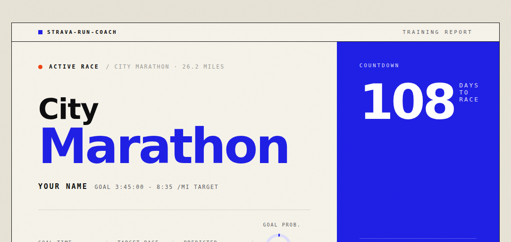
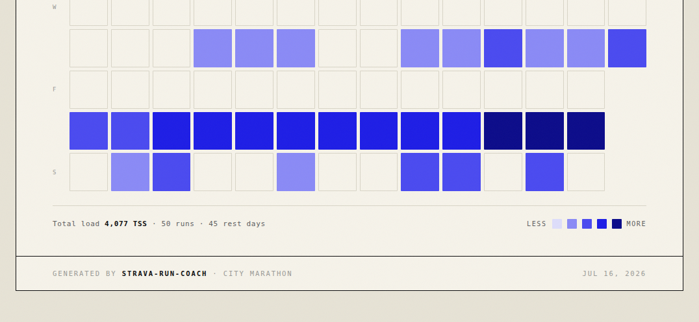

# strava-run-coach

A command-line running coach. It reads your Strava data and computes VDOT race
predictions, CTL/ATL/TSB fitness tracking, adaptive half and marathon plans,
long-horizon training trends, a calendar export, and an HTML dashboard. Built
to be driven by a human at a terminal **or by an AI agent over MCP** — it
ships Claude skills and connects to the official Strava MCP.

[](https://github.com/abrarhaque-code/Strava-Run-Coach/actions/workflows/ci.yml)
[](https://www.python.org/downloads/)
[](LICENSE)



## Why

Most running analytics live behind a subscription or a cloud account, and your
training history lives there too. This runs on your own machine instead. It
reads your Strava export or API feed and turns it into the coaching numbers
that drive training decisions. It uses only the Python standard library, so
the code is small, auditable, and none of your data leaves your computer.
Every model is named and cited — see [docs/METHODOLOGY.md](docs/METHODOLOGY.md),
including the honest caveats (the 10%-rule RCT, the ACWR controversy).

## Features

- Jack Daniels VDOT race prediction with a goal-time probability estimate,
  anchored on your best recent efforts and real race results.
- CTL/ATL/TSB training-load balance (fitness, fatigue, and form) with a
  two-stream model: running mileage and aerobic load are tracked separately,
  so bike cross-training builds your engine without inflating run volume.
- Activity classification at ingest: bike sessions logged as "Run" entries,
  zero-distance rows, and deleted activities never pollute mileage or VDOT.
- Plan reconciliation: actual-vs-planned lands in `data/plan_state.json`
  after every sync, with frozen history and manual-override semantics.
- Long-horizon trends: cardiac drift, pace-at-same-HR efficiency,
  consistency gaps, recovery patterns, elevation cost.
- Eddington number, run streaks, and best efforts at standard distances.
- Adaptive multi-week half and marathon plans with phase structure and
  decision points; base-build scenarios from any entry mileage.
- iCalendar (`.ics`) export so planned workouts land in your calendar.
- A single-file HTML dashboard skinned with a Klein-blue design system.
- Works with Claude out of the box: Strava MCP ingestion, four shipped
  skills, and an installable Claude Code plugin.

## Quick start

```bash
git clone https://github.com/abrarhaque-code/Strava-Run-Coach.git
cd Strava-Run-Coach
python3 coach.py init --sample   # config defaults + generated sample history
python3 coach.py                 # full report
```

There is nothing to `pip install`; it needs only Python 3.10 or newer. The
sample data is deterministic and anchored to today, so the report, dashboard,
countdowns, and heatmap all populate on a fresh clone. Run
`python3 coach.py init` (no flag) for the interactive wizard instead.

## What it looks like

`python3 coach.py forecast`:

```
============================================================
  RACE FORECAST  |  City Marathon, Nov 01 2026
============================================================

Days to race: 108
Goal: 3:45:00 (8:35/mi)

Current fitness VDOT: 37.5
  Source: best 10K effort on 2026-07-14 @ 8:30/mi [Threshold Run]

Goal VDOT (3:45:00): 41.0
Gap: -3.5 VDOT

Predicted finish time: 4:01:59 (9:14/mi)

Goal (3:45:00) probability: 2%  [LOW - fitness gap]

What you need to do:
- Hit at least one quality run with HR >= 165 in next 10 days
- Long run progression: aim for 11+ mi this weekend
- Maintain consistency: 4+ runs/week through race week
```

`python3 coach.py fitness`:

```
  CTL (fitness, 42d):   43.6
  ATL (fatigue, 7d):    55.3
  TSB (form):          -10.1

  Phase: BUILDING
  -> Productive overload. Watch for cumulative fatigue.

  CTL trend (last 90 days):

   44                                                                     *
                                                                    *** ** @
                                                             * * ***   *
                                                  *********** * *
                                    *  * *** *****
                                  ** ** *   *
                         *********
                    *****
              ** ***
   12 ********  *
```

`python3 coach.py scenario --entry 20,25,30`:

```
   Entry   Peak   Avg  Long     Marathon range   Reach base?
     mpw    mpw   mpw   run        (projected)        by Jul
  ----------------------------------------------------------------
      20     38    27    16    4:43:13-5:01:16   comfortable
      25     48    33    20    4:35:53-4:45:49   comfortable
      30     57    40    22    4:31:46-4:43:22        unsafe
```



## Use with Claude

The repo is agent-native. Three ways in:

**claude.ai** — enable the official **Strava** connector (Settings →
Connectors; requires a Strava subscription), then ask Claude to analyze your
training. The shipped skills tell it exactly how to pull your history and
drive the engine.

**Claude Code, from a clone** — the checked-in `.mcp.json` offers the
official Strava MCP (`https://mcp.strava.com/mcp`, OAuth — no keys to
manage) on first use, and the skills in `.claude/skills/` load automatically:
`strava-coach-analyze`, `weekly-review`, `race-forecast`, `build-plan`.

**Claude Code, as a plugin** — no clone needed:

```
/plugin marketplace add abrarhaque-code/Strava-Run-Coach
/plugin install strava-run-coach@strava-run-coach
```

The plugin carries the whole stdlib-only engine with it. (If you both clone
the repo and install the plugin, the skills appear twice — harmless.)

No Strava subscription? Everything still works from the sample data, the
Strava bulk-export CSV, or the free API sync below.

## Connect your Strava (optional)

The sample data lets you try everything immediately. To run on your own
training, connect the Strava API:

1. Create an API application at https://www.strava.com/settings/api and request
   the `activity:read_all` scope.
2. `cp .env.example .env`
3. Fill in `STRAVA_CLIENT_ID` and `STRAVA_CLIENT_SECRET` in `.env`.
4. `python3 strava_authorize.py` for the one-time OAuth handshake.
5. `python3 strava_sync.py` to pull your activities.

Headless environments (CI, cloud sessions) can export `STRAVA_*` environment
variables instead of using a `.env` file. Your data stays on your machine.
`.env`, `activities.csv`, and the Strava cache are gitignored.

## Configuration

All personalization lives in one file. Copy `config.example.json` to
`config.json` (or let `coach.py init` do it) and edit:

- `athlete` - max HR, threshold HR, easy-run HR cap, threshold pace, units.
- `pace_zones` - your easy, tempo, threshold, and race-pace bands.
- `races` - a list of goal races. `active_race` defaults to `"auto"`, which
  picks the earliest upcoming race and rolls over the day after each race.
- `race_history` - completed race results; a real race is the strongest
  fitness anchor the predictor can use.
- `crosstrain` / `strength` - how bike work and lifting credit aerobic load.
- `trends`, `scenario`, `report` - analysis thresholds and toggles.
- `theme` - the dashboard palette and fonts (ships with the Yves Klein Blue
  design-system tokens).

Have the Strava MCP? `python3 coach.py init --from-mcp-zones zones.json`
calibrates your HR caps and pace bands from a saved `get_athlete_zones`
payload. `config.json` is gitignored; if it is absent, the app falls back to
`config.example.json` so a fresh clone still runs.

## Commands

`coach.py` is the single entry point. Sub-commands:

| Command | What it does |
| --- | --- |
| `python3 coach.py` | Full report: brief, fitness, metrics, forecast, last-run review, weekly status |
| `python3 coach.py brief` | Today's workout and a fatigue read |
| `python3 coach.py review` | Debrief of your latest run (laps, cardiac drift) |
| `python3 coach.py fitness` | CTL/ATL/TSB fitness, fatigue, and form |
| `python3 coach.py forecast` | VDOT race prediction and goal probability |
| `python3 coach.py metrics` | Eddington number, streaks, best efforts |
| `python3 coach.py trends` | Long-horizon lenses: drift, efficiency, recovery |
| `python3 coach.py week` | Weekly check-in and plan compliance |
| `python3 coach.py scenario --entry 20,25,30` | Base-build scenarios: entry mileage → peak → marathon range |
| `python3 coach.py plan --entry 25 --weeks 16 [--ics]` | Generate a periodized plan (+ calendar feed) |
| `python3 coach.py analyze --from-mcp <f.json>... [--performance <f>]` | Ingest Strava MCP JSON, then report |
| `python3 coach.py reconcile` | Record actual-vs-planned into plan_state.json |
| `python3 coach.py note "..."` | Timestamped adjustment note for this week |
| `python3 coach.py dashboard` | Render the static HTML dashboard |
| `python3 coach.py sync` | Sync from Strava, reconcile, full report |
| `python3 coach.py init [--sample]` | Setup wizard (or non-interactive demo bootstrap) |

## How it works

`activities.csv` is the data interface for the whole system: the Strava
bulk-export CSV, parsed by fixed column index; the API sync and the MCP
adapter write the same shape. Richer per-activity detail (laps, best efforts,
heart rate) lives in a local JSON cache. `enrichment.classify_activity()` is
the single source of truth for "is this a real run?" — every consumer filters
through it. `config.py` centralizes all athlete-specific numbers so the rest
of the code stays generic. For the module map see
[docs/ARCHITECTURE.md](docs/ARCHITECTURE.md); for the sports science and its
limits see [docs/METHODOLOGY.md](docs/METHODOLOGY.md).

## Tests

```bash
python3 -m unittest discover -s tests
```

150+ standard-library `unittest` tests; the suite runs with no `.env`, no
`config.json`, and no network, and CI exercises it across Python 3.10-3.13
with zero install steps.

## License

MIT. See [LICENSE](LICENSE).
