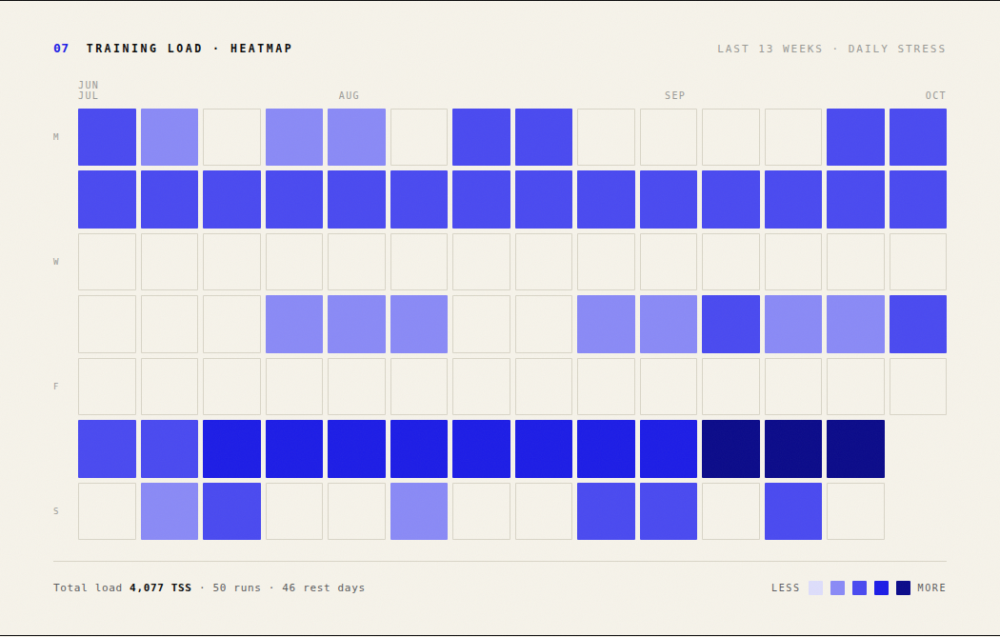

# strava-run-coach

A running coach that lives in your Claude. Connect Strava, say **"coach me"**,
and it reads your last three months, learns your zones and the race you are
training for, asks one question (your goal time), builds a plan around your
week, and then coaches you run by run: an honest debrief of every run, what to
do today, a weekly check-in, and a straight answer to "can I run 3:45?".

Everything runs on your own machine in plain Python. No subscription, no
account, nothing to install beyond Python itself, and your data never leaves
your computer.

[](https://github.com/abrarhaque-code/Strava-Run-Coach/actions/workflows/ci.yml)
[](https://www.python.org/downloads/)
[](LICENSE)

## Start in one conversation

1. **Connect Strava to Claude.** In claude.ai or Cowork: Settings → Connectors →
   **Strava**. In Claude Code: open this repo and approve the Strava MCP it
   offers (OAuth, nothing to copy), or install the plugin without cloning:

   ```
   /plugin marketplace add abrarhaque-code/Strava-Run-Coach
   /plugin install strava-run-coach@strava-run-coach
   ```

2. **Say "coach me".** Claude pulls your recent history, sets the coach up
   from your Strava profile and zones, and reads the race back to you:

   > Strava says you're training for the **New York City Marathon** on
   > **Nov 1** (26.2 mi). What's your goal time? Correct anything that's wrong
   > in the same reply.

3. **Talk to it like a coach.** "How was my run?" "How did my week go?"
   "Can I run 3:45?" "I can only run four days." "No speedwork until my calf
   settles." Each one is a skill that knows what to pull and what to say.

That is the whole setup. Miles or kilometres follow your Strava preference.

## What you get

- **A debrief of every run, with a grade.** Did you keep the easy miles
  easy? Did you hit the workout you set out to do? Did the long run hold
  together, or did the fast miles fall apart at the end? How much did it
  cost you, and how fresh will you be tomorrow? It judges the run against
  what *you* wrote in the Strava description first ("13 easy, 3 at half
  pace, 2 easy"), not against a template, and it tells you when your
  watch's heart-rate trace looks unreliable instead of trusting it.
- **Today's session.** What the plan says for today, adjusted for the notes
  you have given it ("travelling this week, easy only"), with a read on how
  fresh you are.
- **A weekly check-in.** Last week against the plan, this week laid out day
  by day, grades for the recent runs, the next checkpoint, and one thing to
  focus on. Missed a week? It adjusts and moves forward; it does not lecture.
- **A plan built around you.** Your race, your current volume, the days you
  can run, the day you want your long run, lifting days, an injury or a
  comeback. Regenerate it any time; the plan bends to your life, not the
  other way round.
- **A straight race forecast.** Predicted finish time from your best recent
  efforts, the odds of your goal as an honest range, and what would actually
  move the number.
- **Coaching that does not cry wolf.** It will not call you "overreached" off
  two weeks of data, will not read a fast finish as a breakdown without
  asking, and will not confuse a hot day with a hard day. The rules it holds
  itself to are written down in [docs/COACHING.md](docs/COACHING.md).

## What it looks like

A run you described on Strava as "3 easy, 4 tempo, 2 easy":

```
  Classification:    TEMPO  (from intent)
  Execution score:   A (100/100)
  You said:          3 easy, 4 tempo, 2 easy  (from the description)

  Lap 3:  1.00 mi @  10:00/mi | HR 140
  Lap 4:  1.00 mi @   9:00/mi | HR 158 [tempo]
  Lap 5:  1.00 mi @   9:00/mi | HR 158 [tempo]
  ...
  [+] Intent: Ran 9.0 mi as you described it: 3 easy, 4 tempo, 2 easy.
  [+] Easy: 4 of 4 easy splits under the easy cap 148 (HR 140-145,
      10:00-10:10/mi).
  [+] Quality: tempo splits #4-7: 9:00/mi, HR 158, inside the tempo
      band (8:50-9:10/mi).
  [+] Finish: After the declared work you ran 10:10/mi vs 10:00/mi in
      the opening splits (+10 s): held.
```

Your week, laid out:

```
  Target: 30.0 mi  |  Long run: 12.6 mi
  Key workout: Easy week with 4-6 strides on one easy run. No quality yet.
  Notes: Aerobic base. All easy. Consistency over heroics.

  7-DAY LAYOUT:
    Mon Sep 28:  Easy 4.5 mi @ 10:00-10:30/mi, HR < 148
    Tue Sep 29:  Easy 3.9 mi + 4 x 15 s strides @ 10:00-10:30/mi, HR < 148
    Wed Sep 30:  Rest
    Thu Oct 01:  Easy 4.5 mi @ 10:00-10:30/mi, HR < 148
  > Fri Oct 02:  Rest
    Sat Oct 03:  Long run 12.6 mi @ 10:00-10:30/mi, HR < 145
    Sun Oct 04:  Easy 4.5 mi @ 10:00-10:30/mi, HR < 148

  Standing notes (they shape the layout above):
    - no speedwork until the calf settles (until 2026-10-20)
```

The forecast, in one screen:

```
Current fitness VDOT: 37.5
  Source: best 10K effort on 2026-09-29 @ 8:30/mi [Threshold Run]
Goal VDOT (3:45:00): 41.0
Predicted finish time: 4:01:59 (9:14/mi)
Goal (3:45:00) probability: 2%  [LOW - fitness gap]

What you need to do:
- Hit at least one quality run with HR >= 165 in the next 10 days
- Long run progression: aim for 10.4 mi+ this weekend
- Maintain consistency: 5+ runs/week through race week
```

And a dashboard you can open in a browser, regenerated whenever you like:




## Prefer the terminal?

Everything Claude does, you can do yourself. Python 3.10 or newer is the only
requirement.

```bash
git clone https://github.com/abrarhaque-code/Strava-Run-Coach.git
cd Strava-Run-Coach
python3 coach.py init --sample   # a demo athlete, so you can see everything working
python3 coach.py                 # the full report
```

To run it on your own training without the Strava MCP, connect the Strava API
once (create an app at https://www.strava.com/settings/api, copy
`.env.example` to `.env`, run `python3 strava_authorize.py`, then
`python3 strava_sync.py --backfill 90`). The bulk-export CSV from Strava works
too. `python3 coach.py init` walks you through the setup questions.

| Say to Claude | Or run |
| --- | --- |
| "coach me" | `python3 coach.py` |
| "what should I do today" | `python3 coach.py brief` |
| "how was my run" | `python3 coach.py review [<id>]` |
| "how did my week go" | `python3 coach.py week` |
| "can I run 3:45" | `python3 coach.py forecast` |
| "build me a plan, I can run 4 days" | `python3 coach.py plan --from-data --days 4` |
| "no speedwork until my calf settles" | `python3 coach.py note "..." --until 2026-10-20` |
| "what if I trained at 50 km a week" | `python3 coach.py scenario --entry 40,50,60` |
| "how fit am I" | `python3 coach.py fitness` |
| | `python3 coach.py dashboard` |

The full command list, with every flag, is in [CLAUDE.md](CLAUDE.md).

## Your data stays yours

The coach reads Strava and writes to a folder on your machine: as a plugin,
`~/.claude/plugins/data/strava-run-coach/`; from a clone, the repo folder
(`data/`, `config.json` and `plan_output/` are gitignored). Nothing is sent
anywhere. The whole engine is the Python standard library, small enough to
read in an afternoon, so you can see exactly what it does with your numbers.

## Under the hood, briefly

Every number comes from a named model you can read about in
[docs/METHODOLOGY.md](docs/METHODOLOGY.md), caveats included: race prediction
from Jack Daniels' VDOT tables anchored on your best recent efforts and real
race results; fitness, fatigue and form from the Banister training-load
model (CTL/ATL/TSB), with running volume and aerobic load tracked
separately so bike cross-training counts without inflating your mileage;
decoupling measured at matched pace rather than first half vs second half;
a run grade that scores the easy cap, the declared work, the finish and the
clock cap. All of your personal numbers live in one file, `config.json`,
which the Strava setup writes for you and which you can edit by hand. The
module map is in [docs/ARCHITECTURE.md](docs/ARCHITECTURE.md).

## Tests

```bash
python3 -m unittest discover -s tests
```

400+ standard-library tests, including two end-to-end suites that run the
whole thing in a subprocess. No network, no `.env`, no `config.json` needed;
CI runs them on Python 3.10 to 3.13 with zero install steps.

## License

MIT. See [LICENSE](LICENSE).
