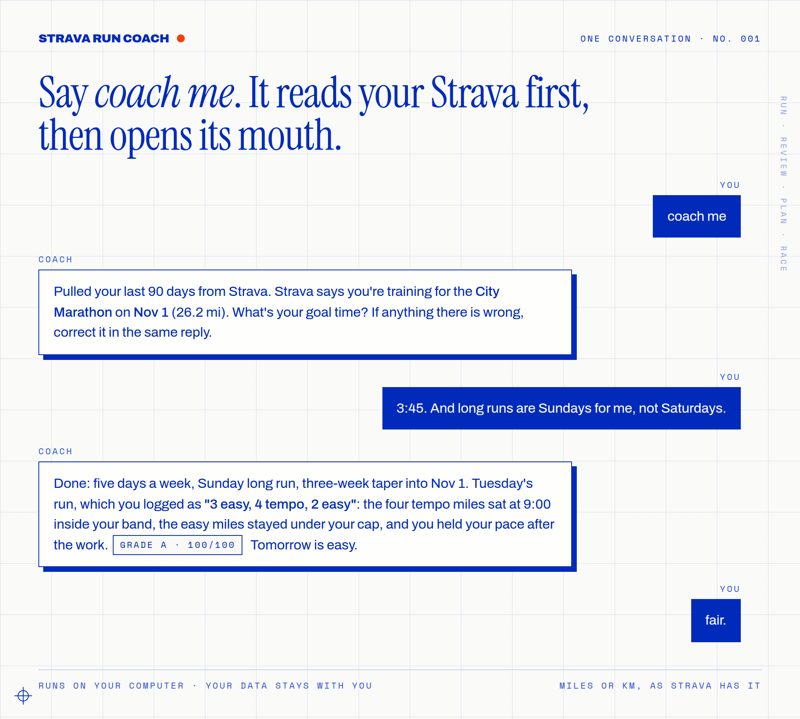
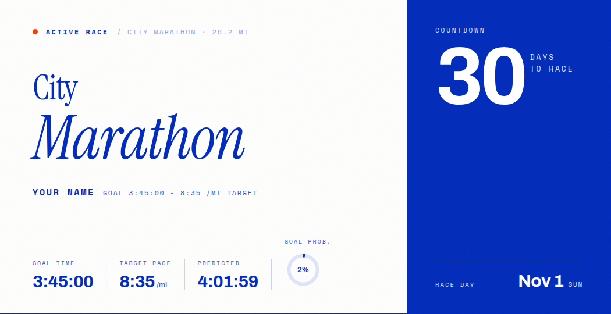

# Strava Run Coach

*An honest running coach that reads your Strava, lives in your Claude, and talks like a person.*

Say **"coach me"**. It reads your last three months of running, finds the race
you are training for, asks one question (your goal time), and builds a plan
around the days you can actually run. Then it coaches: a straight debrief of
every run, what to do today, a weekly check-in, and a real answer to "can I run
3:45?".



## What it does for you

**After a run.** It tells you how the run went against what *you* said you were
going to do. Write "3 easy, 4 tempo, 2 easy" in the Strava description and it
grades exactly that: were the easy miles easy, did the tempo miles land, did you
hold it together afterwards. It also tells you when your watch's heart rate
looks wrong instead of trusting it.

**Every morning.** What today's session is, how far, how easy, and how fresh you
are after the last three days.

**Every Monday.** Last week against the plan, this week laid out day by day, a
grade for each recent run, the next checkpoint, and one thing to focus on.
Missed a week? It adjusts and moves on. No lecture.

**When life happens.** "I can only run four days." "My long run has to be
Sunday." "No speedwork until my calf settles." The plan bends; you don't start
over.

**Before race day.** A predicted finish time from your best recent efforts,
your odds as an honest range, and what would actually move them.

## Get started

The coach's brain runs on your own computer, which is how your data stays
yours, so Claude needs a place to run it. You need Python 3.10 or newer (Macs
offer to install it the first time something asks; Windows gets it from
[python.org](https://www.python.org/downloads/)) and about five minutes.

**In the Claude desktop app (Cowork)**

1. Settings → Connectors → turn on **Strava** and sign in to Strava once.
2. Download this project (the green **Code** button → **Download ZIP**), unzip
   it, and open that folder in Cowork.
3. Say **coach me**.

**In Claude Code** (Anthropic's coding assistant that runs in a terminal), paste
these two lines, say yes when it offers the Strava connection, then say
**coach me**:

```
/plugin marketplace add abrarhaque-code/Strava-Run-Coach
/plugin install strava-run-coach@strava-run-coach
```

In a web browser alone, Claude can read your Strava but has nowhere to run the
coach; use the desktop app or Claude Code. No Claude at all? It also runs from
a terminal: see [docs/TERMINAL.md](docs/TERMINAL.md).

Miles or kilometres follow your Strava setting. It asks you one thing: your
goal time.

## Things to say to it

- "how was my run"
- "how did my week go"
- "what should I do today"
- "can I run 3:45"
- "I can only run four days a week"
- "my long run has to be Sunday"
- "no speedwork until my calf settles"
- "what if I trained at 50 km a week"
- "put my workouts on my calendar"

## It won't cry wolf

- It won't call you overtrained off two weeks of data. Fitness is a six-week
  average; with less history it says the numbers are still warming up, and
  leaves it there.
- It won't read a fast finish as a blow-up. Plenty of us run the last miles of
  a long run hard on purpose. It asks before it judges.
- A hot day is not a hard day. Heart rate is what the day cost you; pace is
  what you did. It says which one moved.
- A missed week is adjusted, not lectured.

The rules it holds itself to are written down in
[docs/COACHING.md](docs/COACHING.md).

## Why I built this

<!-- Abrar: your words here; this is a draft to edit before merging. -->

I built this while training for a half and then a marathon. I had Strava, a
watch and a shelf of template plans, and none of them read what I had actually
done last week. I wanted a coach that looks at the data before it opens its
mouth: one that notices the easy run that wasn't easy, tells me when my goal is
a coin flip rather than a sure thing, and adjusts when life eats a week instead
of lecturing me about it. This is the part of that coach any runner can use.

## Your data

The coach reads Strava and writes to a folder on your computer. With the Strava
connector, your runs pass through your Claude conversation the way anything you
share with Claude does; nothing is sent anywhere else, there is no account and
no subscription, and the code is small enough to read. Details in
[SECURITY.md](SECURITY.md).



*There is also a dashboard you can open in a browser, for when you want the
picture.*

Questions or ideas: [GitHub Discussions](https://github.com/abrarhaque-code/Strava-Run-Coach/discussions).

<details>
<summary><strong>For the technically curious</strong></summary>

The whole engine is Python 3.10+ standard library: nothing to install, one
command (`python3 coach.py <command>`), and the Claude skills in
`.claude/skills/` just run those commands and relay the output under the rules
in `docs/COACHING.md`. Race prediction is Jack Daniels' VDOT anchored on your
best recent efforts and real race results. Fitness, fatigue and form are the
Banister CTL/ATL/TSB model, with running mileage and aerobic load tracked as two
streams so bike cross-training counts without inflating your mileage.
Decoupling is measured at matched pace, not first half against second half.
Every run gets a five-dimension grade. Every model is named, cited and caveated
in [docs/METHODOLOGY.md](docs/METHODOLOGY.md).

| Say to Claude | Or run |
| --- | --- |
| "coach me" | `python3 coach.py` |
| "what should I do today" | `python3 coach.py brief` |
| "how was my run" | `python3 coach.py review [<id>]` |
| "how did my week go" | `python3 coach.py week` |
| "can I run 3:45" | `python3 coach.py forecast` |
| "build me a plan, I can run 4 days" | `python3 coach.py plan --from-data --days 4` |
| "no speedwork until my calf settles" | `python3 coach.py note "..." --until 2026-10-20` |
| "what if I trained at 50 km a week" | `python3 coach.py scenario --entry 40,50,60` |
| "how fit am I" | `python3 coach.py fitness` |

Tests: `python3 -m unittest discover -s tests` (430+ tests; no network, no
config needed; CI runs them on Python 3.10 to 3.13).

More: [docs/TERMINAL.md](docs/TERMINAL.md) (run it yourself, connect the Strava
API, the export file), [CLAUDE.md](CLAUDE.md) (every command and flag),
[docs/ARCHITECTURE.md](docs/ARCHITECTURE.md), [CONTRIBUTING.md](CONTRIBUTING.md),
[CHANGELOG.md](CHANGELOG.md).

[](https://github.com/abrarhaque-code/Strava-Run-Coach/actions/workflows/ci.yml)
[](https://www.python.org/downloads/)
[](LICENSE)

</details>

## License

MIT. See [LICENSE](LICENSE).
